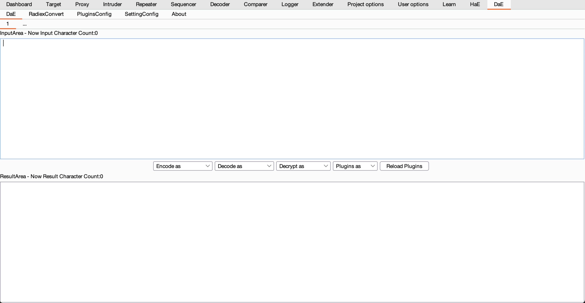

# DaE - Decode and Encode
[CTFCrackTools](https://github.com/Acmesec/CTFCrackTools) 's BurpSuite Plugin - Decode and Encode

Many people suggested that I develop BurpSuite version, so I ported this tool to Burp

 
 
# Support

***Decode/Encode as***
 - MorseCode
 - BaconCode
 - Base64
 - Base32
 - URL
 - Unicode

***Decrypt as***
 - Fence
 - Casar
 - PigCode
 - Rot13
 - Hex2String
 - String2Hex
 - Unicode2Ascii
 - Ascii2Unicode
 - Reverse

# Usage

